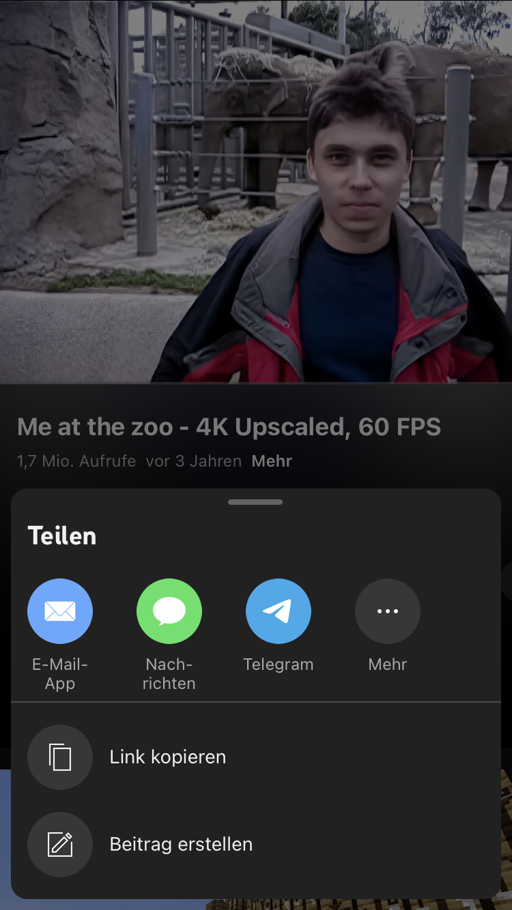

# YouTube Native Share
iOS Tweak to bypass YouTubes own share sheet and use the system activity view instead.
Avoids requesting a source identifier (`si`) with your data and sharing it with other people.
Compatible with YouTube &geq; `19.35.3` on iPhones.
Older app versions are supported by https://github.com/joshuaseltzer/YouTubeNativeShare.
The latest YouTube version on iPads is also supported, don't know about older versions.

## Why
YouTubes share sheet sucks.
It isn't customizable and uses a pre-defined set of URL handlers to check for commonly installed apps (e.g. WhatsApp, Snapchat, Facebook) and then displays those whose URL can be successfully opened:
```
[...]
+|NSURL URLWithString:| @"twitter://://"
-|UIApplication@<0xc90e41c90> canOpenURL:| <NSURL@0x2839eaf00>
[...]
+|NSURL URLWithString:| @"fb-messenger://://"
-|UIApplication@<0xc90e41c90> canOpenURL:| <NSURL@0x2839ece00>
[...]
+|NSURL URLWithString:| @"fb://://"
-|UIApplication@<0xc90e41c90> canOpenURL:| <NSURL@0x2839ed880>
[...]
+|NSURL URLWithString:| @"whatsapp://send://"
-|UIApplication@<0xc90e41c90> canOpenURL:| <NSURL@0x2839ecc00>
[...]
```

Furthermore, before displaying the share sheet, the app requests a source identifier (`si`), that will be appended to the share URL, e.g. https://youtu.be/dQw4w9WgXcQ?si=ABCDEFGHIJKLMNOP.
This allows YouTube to link other users to you if they click on the share URL, which improves their tracking.
This is the data the source identifier is requested with:
<!-- it's obviously not yaml, but yaml syntax highlighting works pretty well here -->
```yaml
<YTIGetSharePanelRequest 0x280597720>: {
    context {
      client {
        hl: "de"
        gl: "DE"
        carrier_geo: "--"
        device_make: "Apple"
        device_model: "iPhone10,4"
        client_name: IOS
        client_version: "18.49.3"
        os_name: "iOS"
        os_version: "16.7.3.20H232"
        screen_width_points: 375
        screen_height_points: 667
        screen_pixel_density: 2
        client_form_factor: SMALL_FORM_FACTOR
        window_width_points: 375
        window_height_points: 667
        connection_type: CONN_WIFI
        config_info {
          cold_config_data: "***REDACTED as I don't know what it represents***"
          cold_hash_data: "***REDACTED as I don't know what it represents***"
          hot_hash_data: "***REDACTED as I don't know what it represents***"
        }
        screen_density_float: 2
        utc_offset_minutes: 60
        content_size_category: "UICTContentSizeCategoryM"
        user_interface_theme: USER_INTERFACE_THEME_DARK
        time_zone: "Europe/Berlin"
        eml_template_context: " \312\354\363\327\245\273\331\362\367\001 \326\321\260\245\311\270\275\317\277\001 \255\265\241\362\340\241\244\240@ \252\220\203\355\360\272\204\317\n \317\325\302\213\354\276\360\357\207\001 \272\316\253\341\217\251\300\254r \272\374\356\201\277\336\251\345Z \307\212\254\310\374\363\216\363Z \345\306\244\207\217\201\203\204( \317\246\303\224\305\236\333\343\243\001 \312\340\221\242\254\357\262\212( \337\306\217\273\372\360\360\272# \322\262\246\261\315\201\371\351\257\001 \205\367\337\266\277\352\251\231? \262\311\332\377\347\340\270\322a \355\212\241\311\207\225\231\260| \324\256\241\333\350\271\254\336\206\001"
        memory_total_kbytes: 2071003
        notification_permission_info {
          notifications_setting: NOTIFICATIONS_SETTING_ENABLED
          last_device_opt_in_change_time_ago_sec: 3547997
        }
        client_store_info {
          ios_store_country: "DEU"
        }
        srs_datapush_build_ids {
          datapush_build {
            build_id: 2828
            access_type: ACCESS_TYPE_EMBEDDED
          }
        }
      }
      user {
        on_behalf_of_user: "133333333333333333337"
      }
      request {
        innertube_token_jar {
        }
      }
      click_tracking {
        click_tracking_params: "\010\207\001\020\211Q\030\000\"\023\010\241\377\227\220\370\364\203\003\025\251\344B\005\035]\226\006X"
      }
      ad_signals_info {
        at_tracking_manager_authorization_status: AT_TRACKING_MANAGER_AUTHORIZATION_STATUS_DENIED
        advertising_id: "00000000-0000-0000-0000-000000000000"
        advertising_id_signal_type: DEVICE_ID_TYPE_UNSPECIFIED
        limit_ad_tracking: true
      }
      active_players {
        player_context_params: "CAESAggC"
      }
    }
    serialized_shared_entity: "CgtHM2VFajNqVUR4Yw%3D%3D"
    installed_sharing_service_ids: 56
    installed_sharing_service_ids: 57
    installed_sharing_service_ids: 55
    installed_sharing_service_ids: 82
    installed_sharing_service_ids: 75
    share_panel_type: SHARE_PANEL_TYPE_SCALABLE_SHARE_SHEET
    sheet_id: "ss_MqcEuhWPbFjRlYjq"
}
```

Aside the tracking, this also makes it impossible to share anything without an internet connection, as the source identifier cannot be requested in this case (I didn't test downloaded offline videos, maybe the source identifier is requested in advance or ommitted here).


## What
This small tweak skips sending the `YTIGetSharePanelRequest` and allows you to share links without a source identifier (`si`).
YouTube most definitely receives all of the information contained in a `YTIGetSharePanelRequest` through other requests anyway - you'd have to stop using YouTube to avoid this - but sharing links without source identifiers will make it at least a bit harder for YouTube to create links between users.

Finally, it also replaces YouTubes own share sheet by the system share sheet:

 


## License


This project is licensed under the GNU General Public License v3.0, see [LICENSE](LICENSE).


## Special Thanks
Thanks to [iCraze](https://github.com/iCrazeiOS) for developing [YTStockShare](https://github.com/iCrazeiOS/YTStockShare), which inspired me to develop a similar tweak for newer YouTube versions.

Thanks to the developers of [FLEX](https://github.com/FLEXTool/FLEX) and [InspectiveC](https://github.com/vr1s/InspectiveC), which both really helped during development of this tweak.
